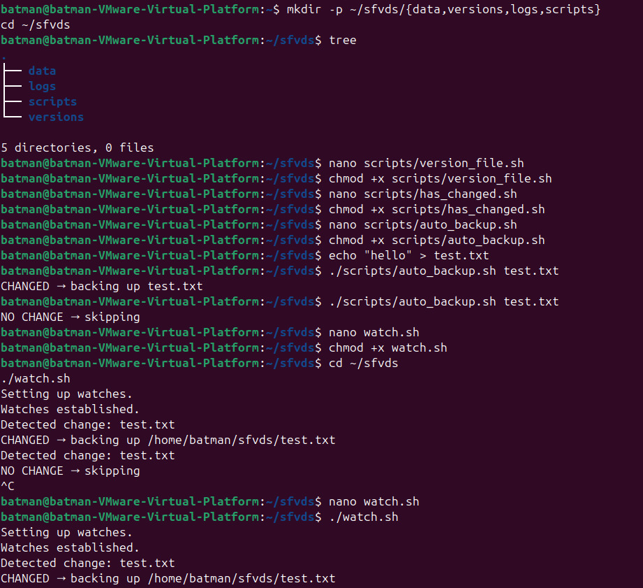
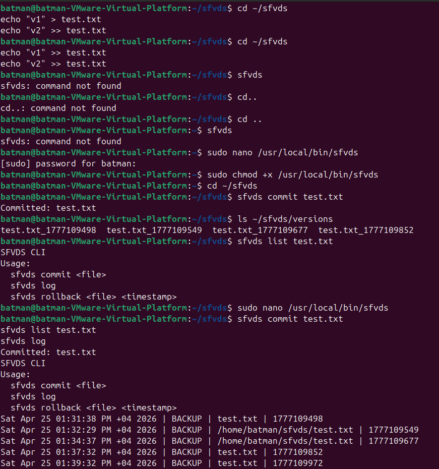
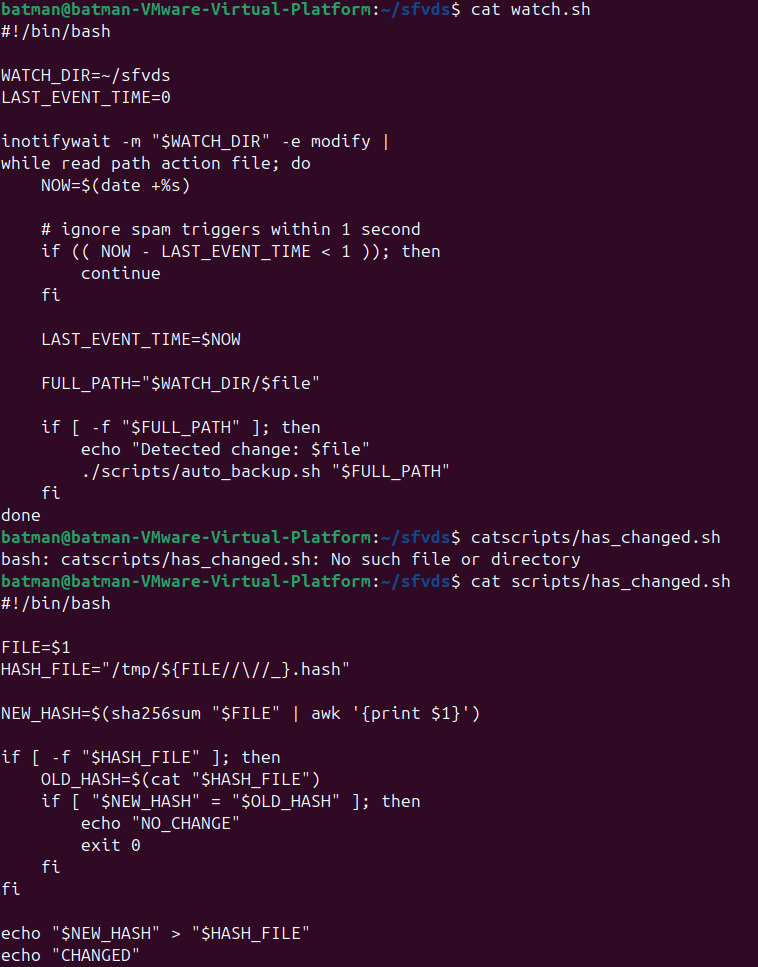

# SFVDS - Simple File Version Detection System

A Linux shell-based file versioning and monitoring system developed using Bash scripting.

## Features

- Automatic file backup
- File versioning
- SHA256-based change detection
- Rollback support
- Activity logging
- Real-time file monitoring

## Technologies Used

- Bash
- Linux
- SHA256
- inotifywait

## Usage

### Run Watch Script

```bash
./scripts/watch.sh
```

### Backup a File

```bash
./scripts/auto_backup.sh test.txt
```

### Rollback a File

```bash
./scripts/rollback.sh test.txt <timestamp>
```

## Authors

- Haziq Afzal
- Ruveeha Ashfaq
- Ambreen Imtiaz
## 📸 Screenshots

### Project Demo






